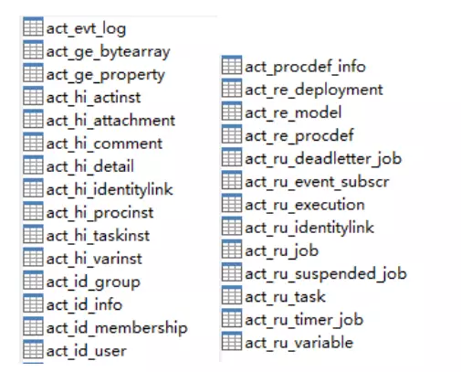
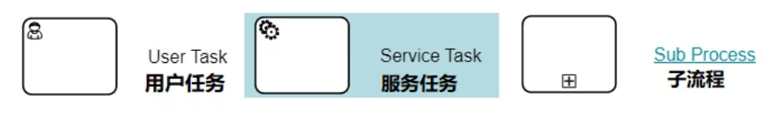
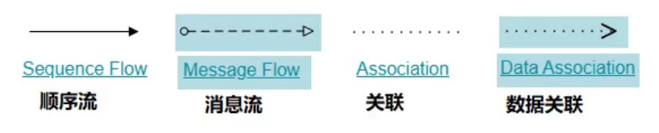

# Activiti

---

## 一、activiti 01

- xml配置
- 默认创建方式 StandaloneProcessEngineConfiguration
- ProcessEngines.getDefaultProcessEngine()

> **默认创建方式：**必须在resource路径下创建activiti.cfg.xml配置文件，且必须在配置文件中声明id为processEngineConfiguration的bean。
>
> **使用ProcessEngines工具类获取ProcessEngine实例：**
>
> ```java
> ProcessEngine processEngine = ProcessEngines.getDefaultProcessEngine();
> ```
>
> <font color = red>注意：文件存储路径、文件名、bean 的 id 都是固定的。</font>

## 二、activiti 02

- xml配置
- 默认创建方式 StandaloneProcessEngineConfiguration
- ProcessEngines.getDefaultProcessEngine()
- 数据库连接池 dbcp

## 三、activiti 03

- xml配置
- 默认创建方式 StandaloneProcessEngineConfiguration
- ~~ProcessEngines.getDefaultProcessEngine()~~
- processEngineConfiguration.buildProcessEngine()
- 数据库连接池 dbcp

> **使用自定义的方式获取ProcessEngineConfiguration，然后创建ProcessEngine实例：**
>
> ```java
> ProcessEngineConfiguration processEngineConfiguration = ProcessEngineConfiguration
>     .createProcessEngineConfigurationFromResource("配置文件名");
> 
> ProcessEngine processEngine = processEngineConfiguration.buildProcessEngine();
> ```
>
> <font color = red>注意：文件名、bean 的 id 允许自定义</font>
>
> ```java
> ProcessEngineConfiguration.createProcessEngineConfigurationFromResource("配置文件名");
> ProcessEngineConfiguration.createProcessEngineConfigurationFromResource("配置文件名","bean的id");
> ```

## 四、activiti 04

- xml配置
- 默认创建方式 StandaloneProcessEngineConfiguration
- processEngineConfiguration.buildProcessEngine()
- 数据库连接池 dbcp
- Service

| service名称       | service作用  |
| ----------------- | ------------ |
| RepositoryService | 资源管理     |
| RuntimeService    | 流程运行管理 |
| TaskService       | 任务管理     |
| HistoryService    | 历史管理     |
| ManagerService    | 引擎管理     |

```java
processEngine.getXXXService();
```

## 五、activiti 05

创建并启动一个activiti工作流（<u>出差申请</u>），主要包含以下几个步骤：

1. 定义流程：按照BPMN的规范，借助相关工具，用**流程符号**将整个流程描述出来（.bpmn文件）。
2. 部署流程：把描述好的流程，加载到数据库中（生成相关表的数据）。
3. 启动流程：使用代码操作相关数据库表的内容。


---

## Activiti 相关信息

### 数据库表



<center>activiti6 数据库表</center>

activiti数据库表大体分为5类：

1. act_ge_ 通用数据表，ge是general的缩写
2. act_hi_ 历史数据表，hi是history的缩写，对应HistoryService接口
3. act_id_ 身份数据表，id是identity的缩写，对应IdentityService接口
4. act_re_ 流程存储表，re是repository的缩写，对应RepositoryService接口，存储流程部署和流程定义等静态数据
5. act_ru_ 运行时数据表，ru是runtime的缩写，对应RuntimeService接口和TaskService接口，存储流程实例和用户任务等动态数据

### BPMN符号

#### 事件 Event


#### 活动 Activity

活动是工作或任务的一个通用术语。一个活动既可以是一个任务，也可以是一个子处理流程。常见的活动类型有：



#### 网关 GateWay

网关用来处理决策，常见的网关有：


#### 流向 Flow

流向即两个流程节点间的连线，常见的流向有：

