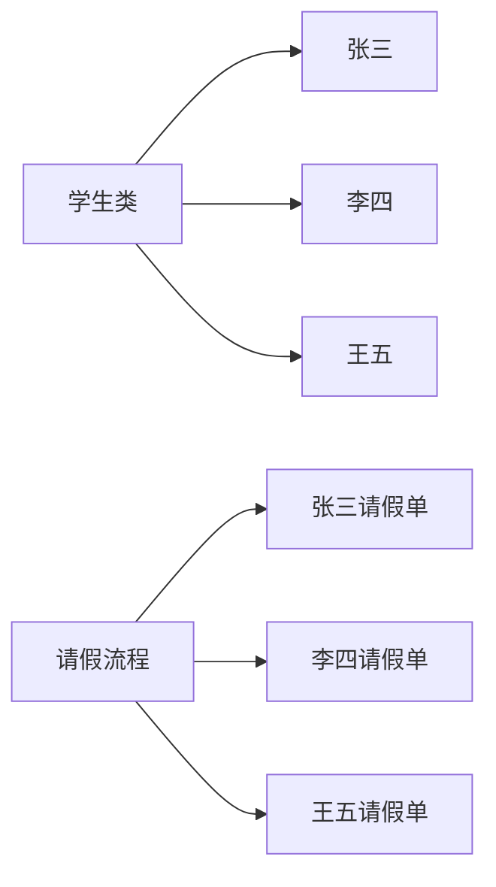
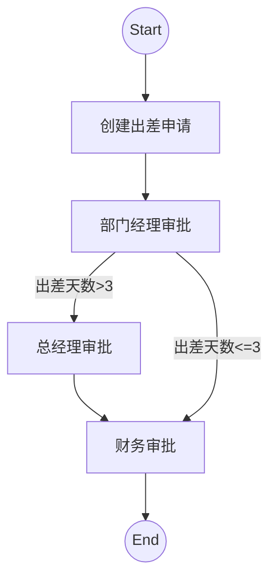

# Activiti

---

## 一、基础部分

### 1.1 activiti 01

- xml配置
- 默认创建方式 StandaloneProcessEngineConfiguration
- ProcessEngines.getDefaultProcessEngine()

> **默认创建方式：**必须在resource路径下创建activiti.cfg.xml配置文件，且必须在配置文件中声明id为processEngineConfiguration的bean。
>
> **使用ProcessEngines工具类获取ProcessEngine实例：**
>
> ```java
> ProcessEngine processEngine = ProcessEngines.getDefaultProcessEngine();
> ```
>
> <font color = red>注意：文件存储路径、文件名、bean 的 id 都是固定的。</font>

### 1.2 activiti 02

- xml配置
- 默认创建方式 StandaloneProcessEngineConfiguration
- ProcessEngines.getDefaultProcessEngine()
- 数据库连接池 dbcp

### 1.3 activiti 03

- xml配置
- 默认创建方式 StandaloneProcessEngineConfiguration
- ~~ProcessEngines.getDefaultProcessEngine()~~
- processEngineConfiguration.buildProcessEngine()
- 数据库连接池 dbcp

> **使用自定义的方式获取ProcessEngineConfiguration，然后创建ProcessEngine实例：**
>
> ```java
> ProcessEngineConfiguration processEngineConfiguration = ProcessEngineConfiguration
>     .createProcessEngineConfigurationFromResource("配置文件名");
> 
> ProcessEngine processEngine = processEngineConfiguration.buildProcessEngine();
> ```
>
> <font color = red>注意：文件名、bean 的 id 允许自定义</font>
>
> ```java
> ProcessEngineConfiguration.createProcessEngineConfigurationFromResource("配置文件名");
> ProcessEngineConfiguration.createProcessEngineConfigurationFromResource("配置文件名","bean的id");
> ```

### 1.4 activiti 04

- xml配置
- 默认创建方式 StandaloneProcessEngineConfiguration
- processEngineConfiguration.buildProcessEngine()
- 数据库连接池 dbcp
- Service

| service名称       | service作用  |
| ----------------- | ------------ |
| RepositoryService | 资源管理     |
| RuntimeService    | 流程运行管理 |
| TaskService       | 任务管理     |
| HistoryService    | 历史管理     |
| ManagerService    | 引擎管理     |

```java
processEngine.getXXXService();
```

### 1.5 activiti 05

创建并启动一个activiti工作流（<u>出差申请</u>），主要包含以下几个步骤：

1. 定义流程：按照BPMN的规范，借助相关工具，用**流程符号**将整个流程描述出来（bpmn文件、png文件）。
2. 部署流程：把描述好的流程，加载到数据库中（生成相关表的数据）。
    - RepositoryService：activiti资源管理类
3. 启动流程（创建流程实例）：使用代码操作相关数据库表的内容。
    - RuntimeService：流程运行管理类

> **定义流程：**
>
> ```mermaid
> graph TB
> start(开始)
> endly(结束)
> task1[创建出差申请]
> task2[经理审批]
> task3[总经理审批]
> task4[财务审批]
> start-->task1-->task2-->task3-->task4-->endly
> 
> ```
>
> 
>
> **部署流程：**
>
> 每进行一次部署，对以下数据库表进行INSERT操作：
>
> | 表名              | 操作                                    |
> | :---------------- | :-------------------------------------- |
> | ACT_RE_DEPLOYMENT | 只插入一条记录，即流程部署信息          |
> | ACT_RE_PROCDEF    | 可插入多条记录，即流程定义信息          |
> | ACT_GE_BYTEARRAY  | 可插入多条记录，即bpmn文件、png文件信息 |
>
> 每进行一次部署，只生成一条流程部署信息，可生成多条流程定义信息。（E-R图）
>
> 
>
> **启动流程（创建流程实例）：**
>
> 没启动一次流程，对下列表进行操作：
>
> | 表明                | 操作A |
> | ------------------- | ----- |
> | ACT_GE_PROPERTY     |       |
> | ACT_HI_ACTINST      |       |
> | ACT_HI_IDENTITYLINK |       |
> | ACT_HI_PROCINST     |       |
> | ACT_HI_TASKINST     |       |
> | ACT_RU_EXECUTION    |       |
> | ACT_RU_IDENTITYLINK |       |
> | ACT_RU_TASK         |       |
>
> 

### 1.6 activiti 06

1. 用户任务查询
    - TaskService：流程任务管理类
2. 用户任务完成

任务完成处理流程（当前任务为”创建出差申请“）：

```sql
update ACT_GE_PROPERTY SET REV_ = ?, VALUE_ = ? where NAME_ = ? and REV_ = ?

// 下一任务开头（设置“任务开始时间”）
insert into ACT_HI_TASKINST ( ID_, PROC_DEF_ID_, PROC_INST_ID_, EXECUTION_ID_, NAME_, PARENT_TASK_ID_, DESCRIPTION_, OWNER_, ASSIGNEE_, START_TIME_, CLAIM_TIME_, END_TIME_, DURATION_, DELETE_REASON_, TASK_DEF_KEY_, FORM_KEY_, PRIORITY_, DUE_DATE_, CATEGORY_, TENANT_ID_ ) values ( ?, ?, ?, ?, ?, ?, ?, ?, ?, ?, ?, ?, ?, ?, ?, ?, ?, ?, ?, ? )

// 下一任务开头（设置“任务开始时间”）
insert into ACT_HI_ACTINST ( ID_, PROC_DEF_ID_, PROC_INST_ID_, EXECUTION_ID_, ACT_ID_, TASK_ID_, CALL_PROC_INST_ID_, ACT_NAME_, ACT_TYPE_, ASSIGNEE_, START_TIME_, END_TIME_, DURATION_, DELETE_REASON_, TENANT_ID_ ) values ( ?, ?, ?, ?, ?, ?, ?, ?, ?, ?, ?, ?, ?, ?, ? ) 

// 下一任务开头
insert into ACT_HI_IDENTITYLINK (ID_, TYPE_, USER_ID_, GROUP_ID_, TASK_ID_, PROC_INST_ID_) values (?, ?, ?, ?, ?, ?) 

// 下一任务开头
insert into ACT_RU_TASK (ID_, REV_, NAME_, PARENT_TASK_ID_, DESCRIPTION_, PRIORITY_, CREATE_TIME_, OWNER_, ASSIGNEE_, DELEGATION_, EXECUTION_ID_, PROC_INST_ID_, PROC_DEF_ID_, TASK_DEF_KEY_, DUE_DATE_, CATEGORY_, SUSPENSION_STATE_, TENANT_ID_, FORM_KEY_, CLAIM_TIME_) values (?, 1, ?, ?, ?, ?, ?, ?, ?, ?, ?, ?, ?, ?, ?, ?, ?, ?, ?, ? ) 

// 下一任务开头
insert into ACT_RU_IDENTITYLINK (ID_, REV_, TYPE_, USER_ID_, GROUP_ID_, TASK_ID_, PROC_INST_ID_, PROC_DEF_ID_) values (?, 1, ?, ?, ?, ?, ?, ?)

// 当前任务结尾（设置“完成时间”）
update ACT_HI_ACTINST set EXECUTION_ID_ = ?, ASSIGNEE_ = ?, END_TIME_ = ?, DURATION_ = ?, DELETE_REASON_ = ? where ID_ = ? 

// 当前任务结尾（设置“完成时间”）
update ACT_HI_TASKINST set PROC_DEF_ID_ = ?, EXECUTION_ID_ = ?, NAME_ = ?, PARENT_TASK_ID_ = ?, DESCRIPTION_ = ?, OWNER_ = ?, ASSIGNEE_ = ?, CLAIM_TIME_ = ?, END_TIME_ = ?, DURATION_ = ?, DELETE_REASON_ = ?, TASK_DEF_KEY_ = ?, FORM_KEY_ = ?, PRIORITY_ = ?, DUE_DATE_ = ?, CATEGORY_ = ? where ID_ = ? 

// 当前任务结尾，下一任务开头。
update ACT_RU_EXECUTION set REV_ = ?, BUSINESS_KEY_ = ?, PROC_DEF_ID_ = ?, ACT_ID_ = ?, IS_ACTIVE_ = ?, IS_CONCURRENT_ = ?, IS_SCOPE_ = ?, IS_EVENT_SCOPE_ = ?, IS_MI_ROOT_ = ?, PARENT_ID_ = ?, SUPER_EXEC_ = ?, ROOT_PROC_INST_ID_ = ?, SUSPENSION_STATE_ = ?, NAME_ = ?, IS_COUNT_ENABLED_ = ?, EVT_SUBSCR_COUNT_ = ?, TASK_COUNT_ = ?, JOB_COUNT_ = ?, TIMER_JOB_COUNT_ = ?, SUSP_JOB_COUNT_ = ?, DEADLETTER_JOB_COUNT_ = ?, VAR_COUNT_ = ?, ID_LINK_COUNT_ = ? where ID_ = ? and REV_ = ? 

// 当前任务结尾（移除）
delete from ACT_RU_TASK where ID_ = ? and REV_ = ? 
```

### 1.7 activiti 07

1. 以zip包的形式，一次性部署多个流程。

2. 流程定义查询

3. 流程定义删除

    与流程定义的部署操作一样，流程定义的删除操作同样需要操作以下3张表：

    | 表名              | 操作                      |
    | :---------------- | :------------------------ |
    | ACT_RE_DEPLOYMENT | 删除流程部署信息          |
    | ACT_RE_PROCDEF    | 删除流程定义信息          |
    | ACT_GE_BYTEARRAY  | 删除bpmn文件、png文件信息 |

4. 资源文件下载

5. 历史信息查看


---

## 二、高级部分

### 2.1 activiti 08

1. Activiti表  ←关联→ 系统业务表

    

    **借助ACT_RU_EXECUTION表中的business_key字段。**

2. 流程挂起、激活

    应用场景：某绩效考核系统，每月最后一天暂停处理出差申请，以进行数据统计。某个流程被挂起后，流程不可创建新的实例，未完成的流程实例也不可向下处理，直到流程被激活。

3. 流程实例挂起、激活

### 2.2 activiti 09 

设置<font color = red>**任务负责人**</font>的3种方式：

- 固定分配：直接在bpmn文件中写死任务负责人，之前的工程使用的都是这种方式。
- 表达式分配
    - UEL-value √
    - UEL-method（未作演示）
    - UEL-value 与 UEL-method 结合（未作演示）
    - 其他（未作演示）
- 监听器分配 √

### 2.3 activiti 10 

<font color = red>**流程变量**</font>的使用（包含全局变量和局部变量）：

1. 在属性上使用UEL表达式（未作演示）
2. 在连线上使用UEL表达式
    - UEL-value（未作演示）
    - UEL-method √
        - 启动流程（创建流程实例）时设置
        - 任务完成时设置
        - 通过流程实例设置（只能是尚未完成的流程）
        - 通过任务实例设置（只能是尚未完成的任务）

### 2.4 activiti 11

组任务

### 2.5 activiti 12

网关

---

## Activiti 相关信息  

### 1. 数据库表


<center>activiti6 数据库表</center>

activiti数据库表大体分为5类：

1. act_ge_ 通用数据表，ge是general的缩写
2. act_hi_ 历史数据表，hi是history的缩写，对应HistoryService接口
3. act_id_ 身份数据表，id是identity的缩写，对应IdentityService接口
4. act_re_ 流程存储表，re是repository的缩写，对应RepositoryService接口，存储流程部署和流程定义等静态数据
5. act_ru_ 运行时数据表，ru是runtime的缩写，对应RuntimeService接口和TaskService接口，存储流程实例和用户任务等动态数据

### 2. BPMN符号

#### 事件 Event


#### 活动 Activity

活动是工作或任务的一个通用术语。一个活动既可以是一个任务，也可以是一个子处理流程。常见的活动类型有：


#### 网关 GateWay

网关用来处理决策，常见的网关有：


#### 流向 Flow

流向即两个流程节点间的连线，常见的流向有：


### 3. 流程实例



类比Java中类与对象的关系，流程定义与流程实例同样是1对n的关系。

### 4. 流程变量

流程变量是Activiti中非常重要的一个角色，通过使用流程变量可以灵活的控制流程的走向。以下面的出差申请流程为例，出差天数就是一个控制流程走向的流程变量：



### 5. 组任务

为任务设置多个候选负责人。

**组任务处理流程：**

1. 查询组任务

    任务候选负责人查询自己可以处理的组任务。

2. 拾取（claim）组任务

    查询到的组任务不能马上进行处理，需要先拾取该任务（即将该任务变为自己的个人任务），允许将拾取到的任务归还回候选人组（即将该任务由个人任务变回组任务）。

3. 查询任务任务

4. 处理个人任务

### 6. 网关

网关用于控制流程的走向。虽然使用流程变量同样可以控制流程的走向，但网关可以实现更灵活、更精细的流程控制。

**网关的分类：**

1. **排他网关**

    

    

    <center>符号</center>

    

    <center>使用案例</center>

    当用作分支网关（将一个顺序流分成多个路径）时，排他网关可以有多个流出路径，但对于某个流程实例，运行时只能在多个路径中选择一条执行。流程执行到排他网关时，依次检查每条路径的变量条件，直到有一条路径的变量条件评估为true。一旦条件评估为true，流程就沿着这条路径向下执行，不在检查其他路径的变量条件。

    通常，只有一条路径被识别为默认路径，这意味着如果其他所有路径的变量条件都为false，则流程将沿着默认路径向下执行。如果没有定义默认路径且所有路径的变量条件都为false，则发生运行时异常。

    当用作聚合网关（将多个顺序流合成一个路径）时，专用网关将<u>传递它接收的任何令牌而不进行同步</u>。

2. **并行网关**

    

    <center>符号</center>

    

    <center>使用案例</center>

    当用作分支网关时，并行网关可以具有2个或更多个传出路径。使用并行网关时，必须为流程实例指定可采用的所有路径。<u>在沿着每条路径行进之前没有检查条件</u>。

    当用作聚合网关时，并行网关将在合并和同步流之前会<u>等待每个传入路径所有令牌的到达</u>。

3. **包含网关**

    

    <center>符号</center>

    

    <center>使用案例</center>

    当用作分支网关（将一个顺序流分成多个路径）时，包含网关可以具有2个或更多个传出路径。它用于沿着条件评估为“True”的所有路径引导顺序流，路径策略可以有一个 或几个或全部。检查每个分支路径的条件，如果它的计算结果为true，则发送一个令牌到路径，使用包含网关，即使遭遇到一个分支的条件评估为“真”之后，也会检查其余分支条件，以查看是否应沿其他路径发送令牌。

    通常，如果有一条路径被识别为默认路径。这意味着如果没有其他路径条件评估为true，则默认路径将自动继续。如果进程建模者未能定义缺省路径且没有任何路径条件评估为true，则会发生运行时异常。

    当用作聚合网关时，包含网关将在合并和同步流之前等待所有令牌到达。每个融合的包含网关需要在流程中的之前有关联的那网关，以便它知道有哪些路径被激活了以及它应该等待多少个令牌，等待哪些令牌。

4. **事件网关**
